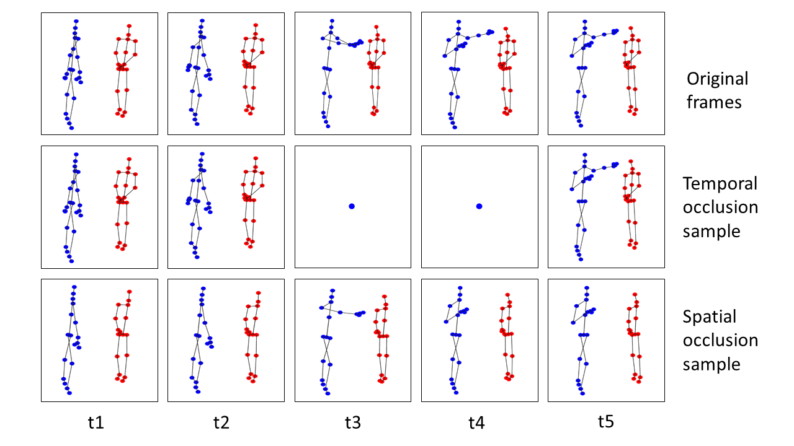

# Richly Activated Graph Convolutional Network (RA-GCN) v1.0

## 1 Paper Details

Yi-Fan Song, Zhang Zhang and Liang Wang. **RICHLY ACTIVATED GRAPH CONVOLUTIONAL NETWORK FOR ACTION RECOGNITION WITH INCOMPLETE SKELETONS.** In ICIP, 2019. [[IEEE ICIP 2019]](https://ieeexplore.ieee.org/document/8802917) [[Arxiv Preprint]](https://arxiv.org/pdf/1905.06774.pdf)

Latest version (RA-GCN v2.0): [[Github]](https://github.com/yfsong0709/RA-GCNv2) [[IEEE TCSVT 2020]](https://ieeexplore.ieee.org/document/9162143) [[Arxiv Preprint]](https://arxiv.org/pdf/2008.03791.pdf)

RA-GCN is a GCN model for incomplete skeleton-based action recognition. The following picture is the pipeline of RA-GCN.
<div align="center">
    
</div>

The incomplete skeleton samples are illustrated by
<div align="center">
    
</div>


## 2 Prerequisites

### 2.1 Libraries

This code is based on [Python3](https://www.anaconda.com/) (anaconda, >=3.5) and [PyTorch](http://pytorch.org/) (>=0.4.0).

Other Python libraries are presented in the **'requirements.txt'**, which can be installed by 
```
pip install -r requirements.txt
```

### 2.2 Experimental Dataset

Our models are experimented on the **NTU RGB+D** dataset [1], which can be downloaded from 
[here](http://rose1.ntu.edu.sg/datasets/actionrecognition.asp).

We only use the **s001-s017 3D skeletons** data. 

There are 302 samples need to be ignored, which are shown in the **'datasets/ignore.txt'**.

### 2.3 Pretrained Models

Several pretrained models are provided, which include **baseline**, **2-stream RA-GCN** and **3-stream RA-GCN** for the **cross-subject (cs)** 
and **cross-view (cv)** benchmarks of the **NTU RGB+D** dataset [1]. The baseline model also means 1-stream RA-GCN.

These models can be downloaded from [BaiduYun](https://pan.baidu.com/s/17F0QDxEuxBqOCDRiXU-UoA) or 
[GoogleDrive](https://drive.google.com/drive/folders/1ajLfO81jYApe-0GZs4lJOysxMF15L3cz?usp=sharing).

You should put these models into the **'models'** folder.


## 3 Parameters

Before training and evaluating, there are some parameters should be noticed.

* (1) **'--path'** or **'-p'**: The path to skeletons files. You should modify its default value in the **'main.py'**. 
For example, if your skeleton files are stored in `<your_path>/nturgbd_skeletons_s001_to_s017/`, then the **'--path'** parameter should be set to `<your_path>`, e.g. `/data4/yfsong/NTU_RGBD`. Note that the folder which stores skeleton files must be named as `nturgbd_skeletons_s001_to_s017`.

* (2) **'--config_id'** or **'-c'**: The config of RA-GCN. You must use this parameter in the command line or the program will output an error. 
There are 4 configs given in the **'configs'** folder, which can be illustrated in the following tabel.

| config_id | 1001      | 1002      | 1003      | 1004      |
| :-------: | :-------: | :-------: | :-------: | :-------: |
| model     | 3s RA-GCN | 2s RA-GCN | 3s RA-GCN | 2s RA-GCN |
| benchmark | cs        | cs        | cv        | cv        |

* (3) **'--resume'** or **'-r'**: Resume from checkpoint. If you want to start training from a saved checkpoint in the **'models'** folder, 
you can add this parameter to the command line.

* (4) **'--evaluate'** or **'-e'**: Only evaluate trained models. For evaluating, you should add this parameter to the command line. 
The evaluating model will be selected by the **'--config_id'** parameter.

* (5) **'--extract'** or **'-ex'**: Extract features from a trained model for visualization. 
Using this parameter will make a data file named **'visualize.npz'** at the current folder.

* (6) **'--visualization'** or **'-v'**: Show the information and details of a trained model. 
You should extract features by using **'--extract'** parameter before visualizing.

Other parameters can be updated by modifying the corresponding config file in the **'configs'** folder or using command line to send parameters to the model, 
and the parameter priority is **command line > yaml config > default value**.


## 4 Running

### 4.1 Train

You can simply train the model by 
```
python main.py -c <config_id>
```
where `<config_id>` is the config file name in the **'configs'** folder, e.g. 1001.

If you want to restart training from the saved checkpoint last time, you can run
```
python main.py -c <config_id> -r
```

### 4.2 Evaluate

Before evaluating, you should ensure the trained model corresponding the config are already saved in the **'models'** folder. Then run
```
python main.py -c <config_id> -e
```

### 4.3 Occlusion

Before occlusion experiments, you should ensure the trained model corresponding the config are already saved in the **'models'** folder. Then run
```
python main.py -c <config_id> -e -op <occlusion_part>
(or)
python main.py -c <config_id> -e -ot <occlusion_time>
```
where `<occlusion_part>` denotes the occluded part (choices, [1,2,3,4,5] means left arm, right arm, two hands, two legs and trunk, respectively),
`<occlusion_time>` denotes the number of occluded frames (choices, [10,20,30,40,50]).

### 4.4 Visualization

To visualize the details of the trained model, you can run
```
python main.py -c <config_id> -ex -v
```
where **'-ex'** can be removed if the data file **'visualize.npz'** already exists in the current folder.


## 5 Results

### 5.1 Top-1 Accuracy

Top-1 Accuracy for the provided models on **NTU RGB+D** [1] dataset.

| models | 3s RA-GCN | 2s RA-GCN | baseline |
| :----: | :-------: | :-------: | :------: |
| NTU cs | 85.9%     | 85.8%     | 85.8%    |
| NTU cv | 93.5%     | 93.0%     | 93.1%    |

### 5.2 Occlusion Experiments

Occlusion experiments on the **cross-subject** benchmark of **NTU RGB+D** dataset [1]. 

The code of **ST-GCN** [2] can be found [here](https://github.com/yysijie/st-gcn).

Part 1,2,3,4,5 denote left arm, right arm, two hands, two legs and trunk, respectively.

| Part           | none     | 1        | 2        | 3        | 4        | 5        |
| :------------: | :------: | :------: | :------: | :------: | :------: | :------: |
| ST-GCN [2] (%) | 80.7     | 71.4     | **60.5** | 62.6     | 77.4     | 50.2     |
| SR-TSL [3] (%) | 84.8     | 70.6     | 54.3     | 48.6     | 74.3     | 56.2     |
| baseline   (%) | 85.8     | 69.9     | 54.0     | 66.8     | **82.4** | 64.9     |
| 2s RA-GCN  (%) | 85.8     | 72.8     | 58.3     | 73.2     | 80.3     | **70.6** |
| 3s RA-GCN  (%) | **85.9** | **73.4** | 60.4     | **73.5** | 81.8     | **70.6** |

Frame 0-50 represent the number of occluded frames.

| Frames         | 0        | 10       | 20       | 30       | 40       | 50       |
| :------------: | :------: | :------: | :------: | :------: | :------: | :------: |
| ST-GCN [2] (%) | 80.7     | 69.3     | 57.0     | 44.5     | 34.5     | 24.0     |
| SR-TSL [3] (%) | 84.8     | 70.9     | 62.6     | 48.8     | 41.3     | 28.8     |
| baseline   (%) | 85.8     | 81.6     | 72.9     | 61.6     | 47.9     | 34.0     |
| 2s RA-GCN  (%) | 85.8     | **82.0** | 74.7     | 64.9     | 52.5     | 38.6     |
| 3s RA-GCN  (%) | **85.9** | 81.9     | **75.0** | **66.3** | **54.4** | **40.6** |


## 6 Citation and Contact

If you have any question, please send e-mail to `yifan.song@cripac.ia.ac.cn`.

Please cite our paper when you use this code in your reseach.
```
@InProceedings{song2019richly,
  title        = {RICHLY ACTIVATED GRAPH CONVOLUTIONAL NETWORK FOR ACTION RECOGNITION WITH INCOMPLETE SKELETONS},
  author       = {Yi-Fan Song and Zhang Zhang and Liang Wang},
  booktitle    = {International Conference on Image Processing (ICIP)},
  organization = {IEEE},
  year         = {2019},
}

@InProceedings{song2020richly,
  title        = {Richly Activated Graph Convolutional Network for Robust Skeleton-based Action Recognition},
  author       = {Yi-Fan Song and Zhang Zhang and Caifeng Shan and Liang Wang},
  booktitle    = {IEEE Transaction on Circuits and Systems for Video Technology (TCSVT)},
  organization = {IEEE},
  year         = {2020},
}
```


## 7 References

[[1]](https://arxiv.org/pdf/1604.02808.pdf) Amir Shahroudy, Jun Liu, Tian-Tsong Ng and Gang Wang. Ntu rgb+d: 
A large scale dataset for 3d human activity analysis. In CVPR, 2016.

[[2]](https://arxiv.org/pdf/1801.07455.pdf) Sijie Yan, Yuanjun Xiong and Dahua Lin. Spatial temporal graph 
convolutional networks for skeleton-based action recognition. In AAAI, 2018.

[[3]](https://arxiv.org/pdf/1805.02335.pdf) Chenyang Si, Ya Jing, Wei Wang, Liang Wang and Tieniu Tan. Skeleton-Based 
Action Recognition with Spatial Reasoning and Temporal Stack Learning. In ECCV, 2018.
